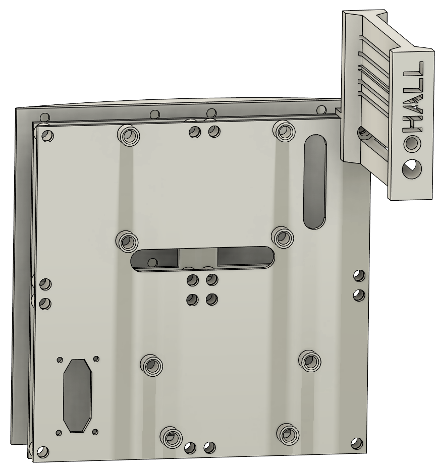
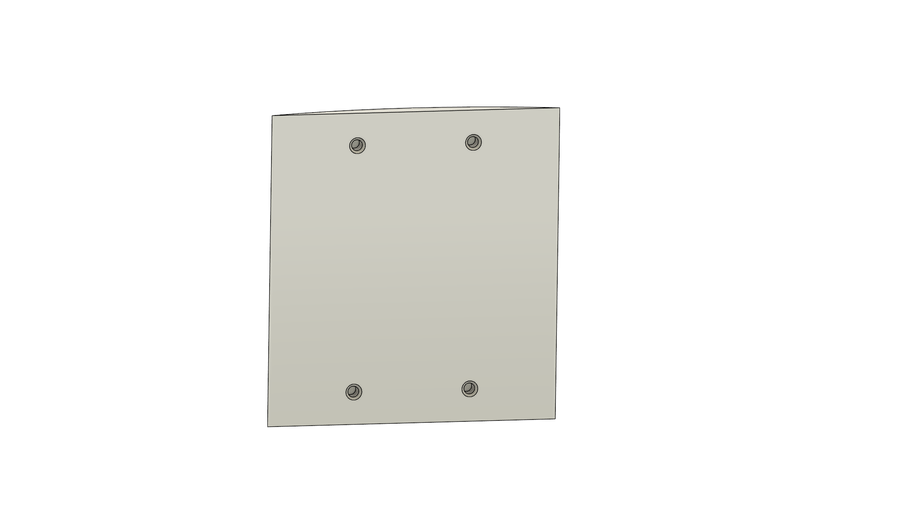
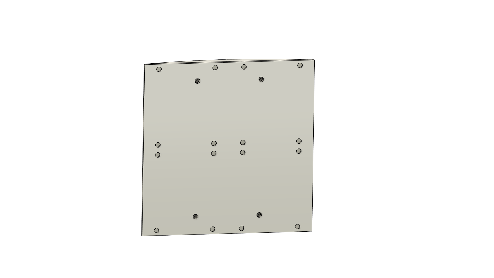
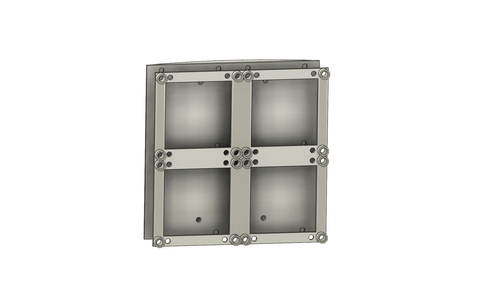
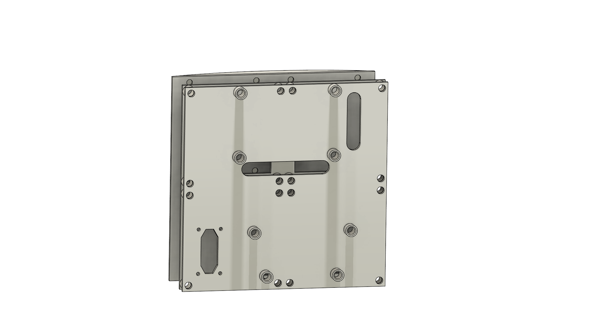
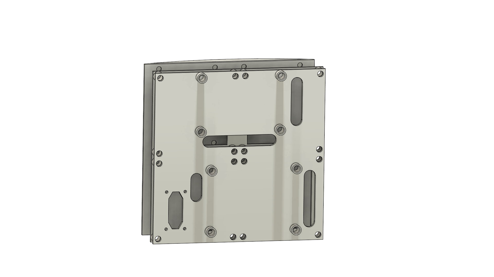
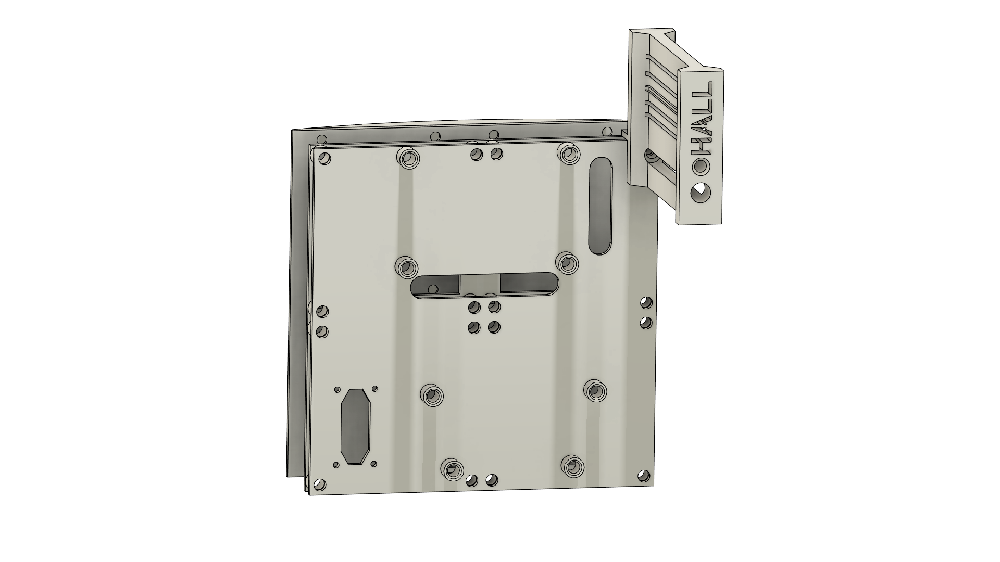
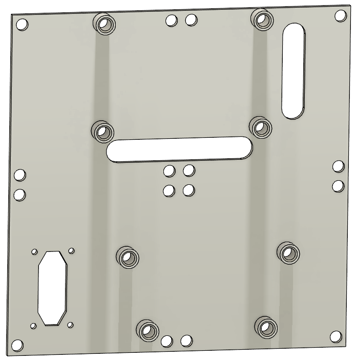
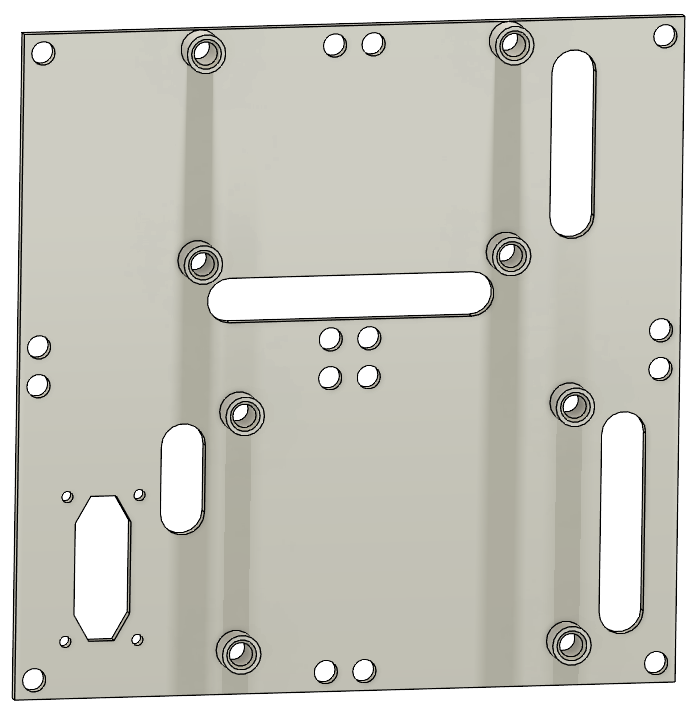
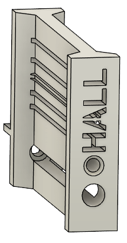

# Documentation Modular Body Backpack (MBB)

</img>

Version 1.0 created by Bastian Oelkuch with Fusion360

# Table of content
- [Documentation Modular Body Backpack (MBB)](#documentation-modular-body-backpack-mbb)
- [Table of content](#table-of-content)
  - [General description and requirements](#general-description-and-requirements)
  - [Overview of the design](#overview-of-the-design)
    - [Frame](#frame-can-be-seen-as-assembly-steps)
    - [Panels](#panels)
  - [Parts list](#parts-list)
    - [Screws and Nuts](#screws-and-nuts)
    - [Threaded inserts, Standoffs \& Bearings](#threaded-inserts-standoffs--bearings)
    - [Connectors and Switches](#connectors)
    - [Boards](#boards)
  - [Assembly Instructions](#assembly-instructions)

<blockquote class="callout warning">
⚠️ <strong>WARNING:</strong> I am not a trained electrician and cannot take any responsibility for any damage or injury that may occur.
</blockquote>

<blockquote class="callout tip">
   🛠 <strong>TIP:</strong> Have a look at the <a href="https://github.com/Buddinski88/R2-D2-Modular-control-unit">R2-D2 Modular Control Unit</a> which is also called MCU if you want a flexible solution for the complete R2 electronics.
</blockquote>

## General description and requirements
- All files have numbers at the end `d1x1` means that the panel has a size of 60x60mm.

## Overview of the design

### Frame (can be seen as assembly steps)

</img>
</img>
</img>
</img>
</img>
</img>

### Panels

| Name                             | Screenshot |
| -------------------------------- | -------- |
| Panel-Buck-Converter_fixed_5V_d4x4.stl | </img> |
| Panel-Buck-Converter-Adjustable_d4x4.stl | </img> |
| Adapter-Hall-Sensor-V2.stl | </img> |

## Parts list

### Screws and Nuts

| Type                             | Quantity | Used for                                                                                               | Link |
| -------------------------------- | -------- | ------------------------------------------------------------------------------------------------------ | ---- |
| **M2x10 mm Cylinder Head Screw** | **4**    | Attaching MPX-like connector to printed panels                                           |      |
| **M3x6 mm Countersunk Head Screw** | **16**  | For connecting `Body-Adapterplate-glued.stl` and `Body-Adapterplate-screwed.stl`                                          |      |
| **M3x6 mm Pan Head Screw**       | **29**   | 16 for connecting `Frame.stl` and `Body-Adapterplate-screwed.stl`                                            |      |
|                                  |          | 4 for connecting the Panel to the Frame                                |      |
|                                  |          | 4 for connection the Benduino Single to the panel                                                        |      |
|                                  |          | 2-4 for attaching the Buck-Converter(s) to the panel                                                            |      |
| **M3x12 mm Pan Head Screw**      | **1**    | 1 for connecting `Adapter-Hall-Sensor-V2.stl` to the frame/panel                                            |      |

### Threaded inserts, Standoffs & Bearings

| Type                             | Quantity | Used for                                                                                               | Link |
| -------------------------------- | -------- | ------------------------------------------------------------------------------------------------------ | ---- |
| **M3x5.7 mm Threaded Insert**   | **27**  | To fill all available inserts on the frame (additional inserts may be required based on panel used), the boards and hallsensor to the panel | [Amazon](https://www.amazon.de/gp/product/B08BCRZZS3)     |
| **M3x25 mm Standoffs**           | **16**   | Connecting the `Body-Adapterplate-glued.stl` and `Body-Adapterplate-screwed.stl`                    | [AliExpress](https://de.aliexpress.com/item/1005003175580805.html)      |

### Connectors

| Type                             | Quantity | Used for                                                                                               | Link |
| -------------------------------- | -------- | ------------------------------------------------------------------------------------------------------ | ---- |
| **MPX-like Connector**           | **1**    | To provide a power connection with power and up to 6 data lines to the body                            | [AliExpress](https://de.aliexpress.com/item/1005001997107973.html)     |

### Boards

| Type                             | Quantity | Used for                                                                                               | Link |
| -------------------------------- | -------- | ------------------------------------------------------------------------------------------------------ | ---- |
| **5V 15A Buck Converter**        | **1**    | Power supply for 5V                                                                                    | [AliExpress](https://de.aliexpress.com/item/1005006506300187.html)     |
| Altenative **5V 10A Buck Converter**       | **1**    | Power supply for 5V                                                                         | [Amazon](https://www.amazon.de/dp/B09GLT7RVS)      |
| **Benduino Single**     | **1**   | "The Brain for all Body related servos"                                                                                             | [printed-droid.com](https://shop.printed-droid.com/produkt/benduino-single-2024/)     |
| **Hall-Sensor**     | **1**   | Will be provided with the AstroCan AutoDome Module                                                                                         | [printed-droid.com](https://shop.printed-droid.com/produkt/astrocan-autodome/)     |

## Assembly instructions

1. Melt in four *M3x5.7 mm threaded inserts* to the `Body-Adapterplate-glued.stl`.
2. Glue with some 2k epoxy the `Body-Adapterplate-glued.stl` to the body (or just use some double-sided tape).
3. Screw the standoffs to the `Body-Adapterplate-screwed.stl`.
4. Screw the `Body-Adapterplate-screwed.stl` to the `Body-Adapterplate-glued.stl`.
5. Scree the `Frame.stl` to the `Body-Adapterplate-screwed.stl`.
6. Prepare the panel of your choice and screw it to the `Frame.stl`.
7. Now you can add the boards and the hall   sensor to finish the assembly.