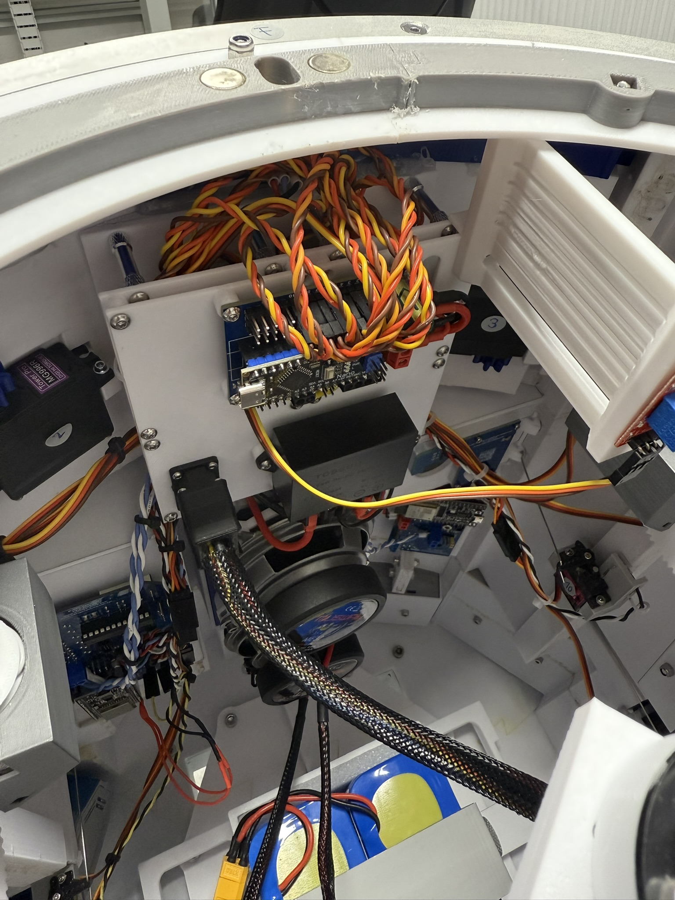
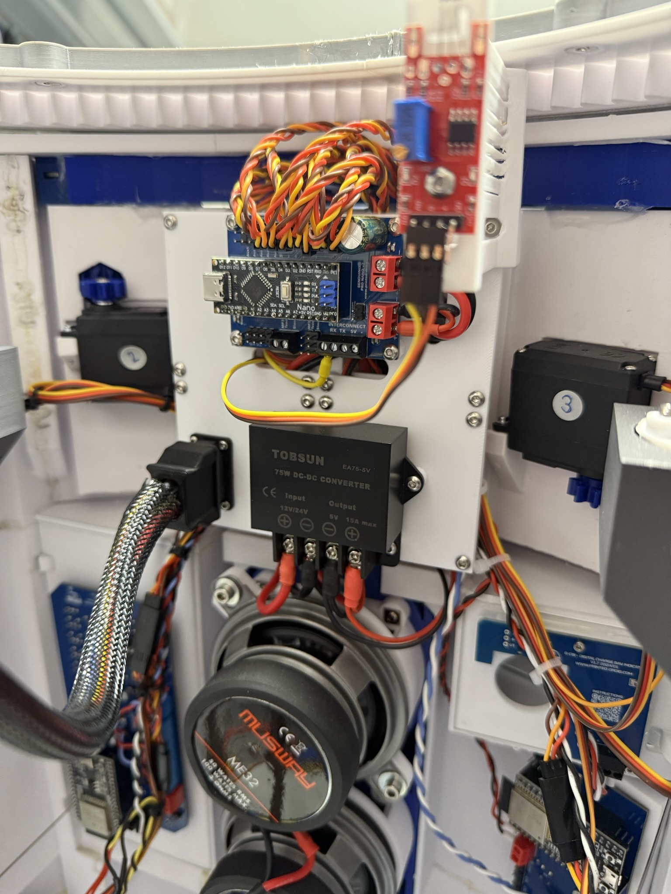

# R2-D2 Modular Body Backpack

## General motivation
- There are many good solutions for organizing all the control electronics for the whole selection of R2D2 bodys.
- However, none of these solutions fully met my requirements, so I designed my own interpretation of a [modular control unit](https://github.com/Buddinski88/R2-D2-Modular-control-unit).
- But so that I can also mount some components in the body, the **Modular Body Backpack** was created.

## Requirements
- The module must be completely removable as a single unit to allow work on it at the workbench.
  - Everything must be possible without any special tools, i.e., plug-and-play instead of screws (almost achieved)!
- The design must be modular, allowing it to be adapted to specific requirements.
- The design must be based on a grid (60x60mm) and offers panels ranging from `1x1` to `NxN`.

## Images

</img> </img>